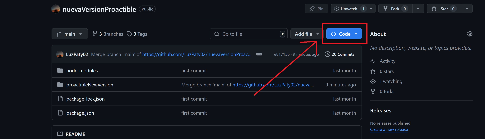
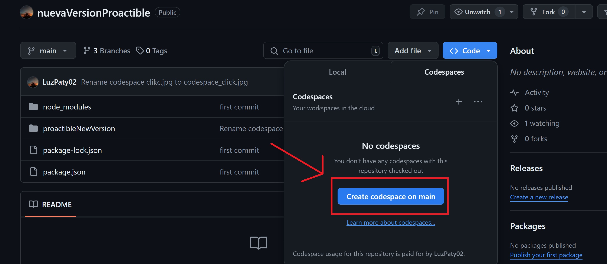
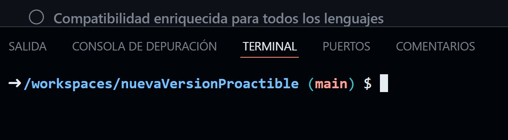
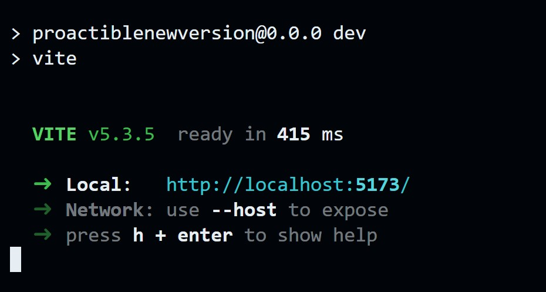

# Instrucciones para Ver los Avances del Proyecto

Sigue los pasos a continuación

## Pasos para Ver Avances

1. **Crear un "Codespace"**
   - Selecciona el botón "Code"
   - Haz clic en el botón `Code <>` en la parte superior del repositorio.
   - Aquí se muestra la imagen de referencia:  
     

   - Haz click en el botón de `Create codespace on main`
     
   - Esto abrirá un entorno de programación, hay que esperar a que cargue ya que toma unos segundos. Cuando haya cargado, se observará una ruta en la terminal.
   
     

2. **Desde la terminal, accede a la Carpeta del Proyecto**
   - Utiliza el siguiente comando para entrar a la carpeta del proyecto:
     ```bash
     cd proactibleNewVersion
     ```

3. **Instala las Dependencias**
   - Corre el siguiente comando:
     ```bash
     npm install
     ```

4. **Ejecuta el Servidor de Desarrollo (Paso esencial para acceder a la previsualización)**
   - Corre el siguiente comando para iniciar el servidor:
     ```bash
     npm run dev
     ```
   - Después de correr el comando, aparecerá lo siguiente:
   
     
     

5. **Haz click en el link generado `http://localhost:...` para acceder a la página web**

# Listo, has accedido a la página :)
